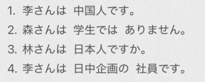

# 1-1   
  
1.++名1++は++名2++==です==  
2.++名1++は++名2++==ではありません==  
  
  
はい、そうです　　　　　　　　是的  
いいえ、ちがいます　　　　　　不是  
  
どうぞ　よろしく　お願いします　请多多关照  
  
四种称呼他人的连词  
-様　-さん　-君　-ちゃん  
  
  
- [ ] ****单词****  
* n  
    * あなた　貴方　　　　　	你  
    * かた　方　　　			（敬称）位，人  
        * あのかた				那个人  
    * りゅうがくせい　留学生  
    * きょうじゅ　教授  
    * かちょう　課長  
    * しゃちょう　社長  
    * でむかえ　出迎え			迎接  
        * 迎える				迎接；迎来；接待；面临「他动·一段」  
  
* adv  
    * ==どうも==					==非常，很==  
  
