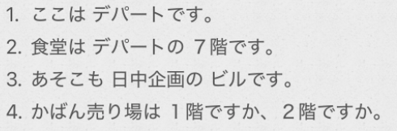

# 1-3  　场所 数字  
  
1. ++ここ/そこ/あそこ++ は ++名++ です  
	指示场所时，用“ここ”“そこ”“あそこ”。所表示的位置关系与“これ”“それ”“あれ”相同。  
2.++名++ は ++名[场所]++ です				  
	表示“名词”存在于“名词[场所]  
5.++名1++	は	++名2++ですか, 	++名3++ですか  
  
  
## 指示词こそあど  
  
「～ちら」是「～こ」和「～れ」的礼貌形  
  
##   
##   
## 数字：479不稳定  
百千万：红色标注的特殊音变，需要额外记忆  
  
  
～階  
  
  
  
- [ ] ****单词****  
* n  
    * ぎんこう　銀行				银行  
    * きっさてん　喫茶店			咖啡馆  
    * じむしょ　事務所				事务所；办事处  
    * ゆうびんきょく　郵便局		邮局  
    * くに　国（训读）				国；国家（单独使用）  
    * こく　国（音读）				～国（和其他词组合使用）  
    * しゅうへん　周辺				附近；周边  
  
  
