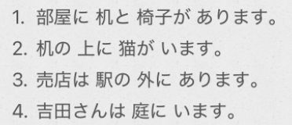

# 1-4  表存在  
  
1.++名[场所]++	に	++名[物/人]	++	があります/います			 ==所在地:	～有～==  
2.++名[物/人]++	は	++名[场所]++		にありますノいます			 ==存在地	～在～==  
  
  
- [ ] **表存在，以下两种表达相同：**  
1。本屋は二階です  
2。本屋は二階にあります  
  
  
- [ ] 疑问词 + も+ 否定 			表示全部否定  
- [ ]   
  
疑问词+も 表全部  
  
- [ ] ****单词****  
* n  
    * にわ　庭						院子  
    * いま　居間					起居室  
    * スイッチ						开关  
    * はこ　箱						盒子；箱子  
    * めがね　眼鏡					眼镜  
    * おとこ　男  
    * おんな　女  
        * 记忆：男：我特扣，女：嗯呐，知道你最扣  
    * せいと　生徒					学生  
    * かいぎしつ　会議室			会议室  
    * ばいてん　売店				小卖部；售货亭  
    * ひとりぐらし　一人暮らし		单身生活  
    * ご〜  
    * お〜  
