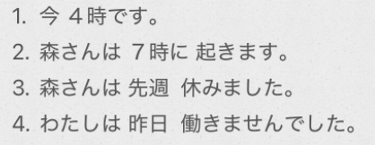

# 2-5　自动词  
  
  
1.今 ~時 ~分です  
2++.动++ます/++动++ません/++动++ました/++动++ませんでした  
3.++名[时间]++ に ++动++  
4.++名1[时间]++ から ++名2[时间]++ まで ++动++  
5.いつ ++动++ます  
  
  
- [ ] **~ます 时态：**  
1。肯定地叙述;  
2。现在的习惯性动作、状态;  
3。未来的动作、状态:  
  
  
- [ ] ****动词四种时态：==先否定，再过去==****  
  
  
- [ ] ****表动作的时间时，に的规律：****  
1。数字时间(3月、2022年)。加に  
2。非数字时间(今日·明日·去年)。不加に：  
3。*曜日。可加可不加  
  
  
- [ ] ****は[表示对比]****  
1. 提示主题：用来宣告“现在开始要聊这个了”。   
2. 表示对比：相当于中文的“……的话”，读重音，暗示“唯独这个不同，别的不是这样”。  
  
  
  
  
  
  
  
  
- [ ] ****单词****  
* n  
    * せんせんしゅう　先々週				上上周  
    * さらいしゅう　再来週					下下周  
    * あさって　明後日						后天  
    * おととい　一昨日						前天  
    * けさ　今朝							今天早上  
    * しけん　試験							考试  
    * しゅっちょう　出張					出差 （记忆，修桥）  
    * ちこく　遅刻							迟到「名，自动，sa变」  
    * おたく　お宅							府上；（您）家(记忆我在你的府上大哭😭)  
  
* v  
    * はたらく　働く						工作；劳动「自动·五段」  
    * べんきょう　勉強						学习「名·自他动·サ变」  
  
