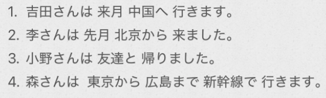

# 2-6 格助词  
  
- [ ] 格助词へ  
  
「へ」提示移动的方向，读作「え」  
  
  
- [ ] ****“に/で/へ/から/まで/と”+は	构成一种复合形式。****  
1.部屋には 電話が ありません。(我的房间没有电话。)  
2.韓国へは 行きました。中国へは 行きませんでした。  
  
  
  
- [ ] ****单词****  
* n  
    * よなか　夜中							午夜；半夜  
    * ゆうべ　夕べ、昨夜				　　昨天晚上  
        * 昨夜　　ゆうべ  
        * 夕方　　ゆうがた  
    * こうつうきかん　交通機関				交通工具  
  
* adv  
    * たしか　確か							确实，好像是；大概；的确(记忆，他确实有洗卡的嫌疑)  
    * まっすぐ　真っ直ぐ					径直；笔直  
  
* 语句  
    * おさきにしつれいします　お先に失礼します	寒暄语：我先告辞了  
        * さき　先　          前面，前方  
    * お疲れ様でした  							寒暄语：辛苦了，够累的  
    * 大変ですね								寒暄语：真不容易，够受的，不得了  
