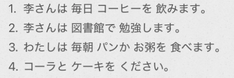

# 2-7  
  
  
- [ ] ****何的读法****  
  
  
  
- [ ] ****单词****  
* n  
    * てがみ　手紙				信  
        * かみ　紙  
        * かみ　髪　头发，发型  
        * かみ　神　神明  
        * かみ　加味  
    * ごぜんちゅう　午前中		上午（一整个上午）  
  
* v  
    *   
  
* adj  
* adv  
    * これから　从现在起，今后  
  
* 语句  
    * そうですか　						是嘛	  
        * 读降调时，表示理解了所听到的新信息。相当于汉语的“是嘛”。  
    * そうですね　						好啊  
        * 用于同意对方的提议，相当于汉语的“好啊"。注意ね"的发音不能拉长，拉长后语意会发生变化。  
    * 失礼します						打扰了；失礼了  
        * ”告辞了”是向长辈或上司道别时的常用语，也可以在进入别人的房间时使用。而在离开别人的房间时可说“*失礼しました(打搅了)"，也可说"失礼Uます"。  
    * おじゃまします　お邪魔します		打扰了  
        *   
    * いってまいります/いってきます　	我走了	  
    * いってらっしゃい					你走好  
        * 暂时离开家或公司时，要离开的人一般说“いってまいります(我走了)"，"いってきます"较为随便的说法。未离开的人可以用“いってらっしゃい"回应，相当于汉语的"去吧"，其中含有说话人盼望对方早点回来的心情。  
    * ただいま　						我回来了  
    * お帰りなさい						你回来了  
        * 回到家里或单位时，回来的人说“ただいま"，在家或单位的人说“お帰りなさい”。  
    * いらっしゃいませ　				欢迎光临  
    * かしこまりました　畏まりました		我知道了  
        * 这两句话都是店员的常用语。“いらっしゃいませ"是顾客进内时，店员对顾客说的问候语。"かしこまりました"是“明白了"的意思，语气非常郑重。"いらっしやい" 省略了"ませ"语气较为随便，也可用于朋友或亲近的人来家里做客时表示欢迎。  
        * 畏まる：分かる自谦语，有种毕恭毕敬、诚惶诚恐的感觉。多用于“下属对上司、服务业人士对客户、写邮件”  
  
  
  
  
  
  
  
