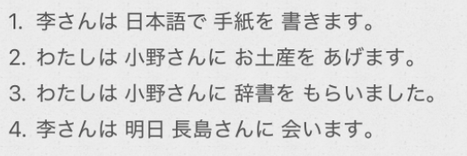

# 2-8 他动词  
  
  
  
- [ ] ****句型****  
名1[人] は 名2[人] ==に== 名3[物] を あけます	  		谁==给==谁什么东西  
名1[人] は 名2[人] ==に== 名3[物] を もらいます		谁从谁==得到==什么东西  
  
- [ ] ****授受动词：****  
* あけます		  
    * 送别人东西时，直接说“あけます"会给人以单方面强加于人的印象。这时候用“どうそ"或"*どうですか(怎么样 ?)"比较适合。  
* もらいます  
    * 接受物品时，如表示从某人那里接受时，可用"[人]に/から もらいます"。人的后面既可用“に"也可用“から"，一般多用“に"。但如果给予的一方是“会社"或“学校"之类的组织或团体时，则用"から"。  
  
- [ ] ****格助词に　表行为的对象****  
* 名[人] に 会います  
  
****を动作的对象？に行为的对象？****  
能回答“做了什么（具体事物）”的，用「を」（直接作用）；能回答“对谁、向谁、给谁做”的，用「に」（指向/间接对象）。  
  
「を」用于动作直接作用并可能改变其状态的对象（如「リンゴを食べる」中，苹果会被吃掉）。  
  
**==“を 是受气包（直接受体），に 是终点站（指向目标）。”==**  
  
  
- [ ] ****よ****  
助词“よ"用于提醒对方注意其不知道、不了解的事请，多读升调。根据使用场景的不同，分别表示告知、提醒、警告等。  
  
- [ ] ****さっき　たった今　****  
"さっき"“たった 今"表示离现在很近的过去。后续的动词一定要用过去形式。说话人如果觉得离现在非常近时用“たった 今(刚刚)"，稍久一点则要用"さっき(刚才)"。  
  
- [ ] ****[名词 1]も [名词 2]も****  
“~も~も"相当于汉语的“~和~都"。  
  
- [ ] ****前（に）****  
「前」可以表示空间上/时间上。“前(に)”中还可以表示过去，相当于“以前"的意思。“に"可以省略。  
  
- [ ] ****〜の件****  
～一事  
  
- [ ] ****名 か 名****  
对若干名词进行选择  
  
  
- [ ] ****单词****  
* n  
    * きねんひん　記念品					纪念品  
    * パンフレット							小册子；宣传册（pamphlet）  
    * スケジュールひょう　スケジュール表		日程表（schedule）  
    * しゃしんしゅう　写真集				影集  
    * おかね　お金							钱；金钱  
    * こうくうびん　航空便					航空邮件  
    * そくたつ　速達						速递；快件「名自动sa变」（记忆，++送++快递的++苦，他吃++）  
    * ファックス							传真(FAX)  
    * じゅうしょ　住所						住址（记忆，住所又旧又小，++旧小++）  
    * なまえ　名前							姓名  
    * けん　件								事件；事情  
    * ゆうがた　夕方						傍晚  
    * いちど　一度							一次  
    *   
  
* v  
    * あげる　上げる						给予；送给「他动·一段」  
    * もらう　貰う							得到；收到；接受；领受「他动·五段」  
    * ==おくる　送る							送；寄送；传递「他动·五段」==(记忆:寄送后，++我哭咯++)  
    * ==だす　出す							出；送；拿出；取出；寄；邮；发==  
    * とどく　届く							到达；送达；收到「自动·五段」(记忆，到达目标后，++偷偷哭++)  
    * かす　貸す							借出；借给「他动·五段」  
    * かりる　借りる						（向别人）借「他动·一段」  
    * おしえる　教える						教；传授；指点；告知「他动·一段」（记忆：++我是耶鲁++大学教的）  
    * ならう　習う							学；向…学习「他动·五段」（记忆：学习就是++拿来主义++）  
    * かける　掛ける						挂上；花费；拨打（电话）；发动（机器）「==他动==·一段」  
    * かかる　掛かる						「==自动==·五段」  
    * ふとる　太る							发胖「自动·五段」  
        * ふとい　太い				胖的  
        * ふとん　布団				被褥	  
  
* adv  
    * さっき								刚才（记忆：刚才我感到了一股++杀气++）  
    * たったいま　たった今					刚刚  
    * まえに　前に							以前  
  
* 语句  
    * もう一度								再一次  
    * わかりました　分かりました 			明白了  
        * 汉语中的“明白了"只用于表示理解了对方所作的说明，而日语中的"分かりました"除此以外，还可用于对对方所说的话表示承诺或者应答。  
    * よかったです							太好了！  
    * 〜様  
