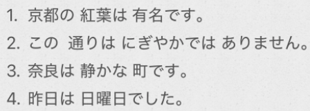
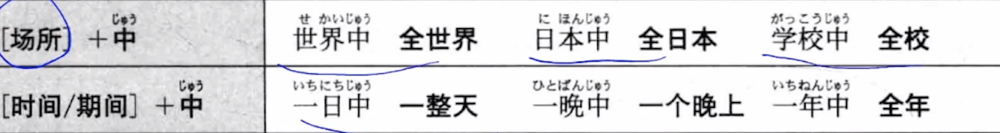

# 3-10	な形容词  
  
- [ ] ****二类形容词****  
二类形容词: 词尾是「だ」/「です」  
* 「だ」是简体；「です」敬体  
* 隐形的小尾巴  
  
- [ ] ****注意：名词＋です　区别****  
名词没有词尾，只是借“で寸”传递信息  
（什么叫传递信息？就是用过です的变形改变语义：でした；ではません；ではませんでした）  
  
- [ ] ****做谓语是，四种形态：==先否定，再过去==****  
**==な形容词 = “伪装成形容词的名词”。==**== 它的否定、过去式、现在式，全都跟着「名词」的逻辑走（即：跟着 です 走）。==  
  
Ps：这里的变否定规矩。也验证了第一课学的 「です」的否定形式就是「ではありません」 。  
  
  
- [ ] ****どんな 	询问人和物的性质。什么样的****  
和どの一样。都是+名词  
  
  
  
- [ ] ****どうですか  	是询问对方对某状态的意见或感想时的表达方式。****  
* 如果询问的是现在或未来的事情时用“どうですか”。  
* 询问的是过去的事情时则用"どうでしたか"  
* 另外“どうですか" 还可用于邀请对方做某事。  
  
  
- [ ] **"でも" 和 "そして"**  
"でも"是表示==转折关系==的连词。  
"そして"是表示==并列关系==的连词。  
  
- [ ] ****の****  
  
  
  
  
  
- [ ] ****单词****  
* n  
    *  こうよう・もみじ　紅葉					红叶  
    * こきょう　故郷							故乡  
    * とおり　通り								大街  
    *  にんぎょう　人形							玩偶  
    *  さくひん　作品							作品  
    *  ちょうこく　彫刻							雕刻  
    * じどうしゃ　自動車						汽车  
    * どうぐ　道具								工具  
    *  シーズン									季节  
    * しゅうがくりょこう　修学旅行				修学旅行  
    * かんこうきゃく　観光客					游客  
    * さっか　作家								作家  
    * ぶちょう　部長							部长  
    * しんにゅうしゃいん　新入社員				新员工  
    * へいじつ　平日							平日；非休息日  
    * せいかつ　生活							生活（生活就是++随意开吃++）  
    * せかい　世界								世界  
  
* adj  
    * ==きらい　嫌い								讨厌[形2]==  
    * べんり　便利								便利[形2]  
    * ふべん　不便								不便[形2]  
    * かんたん　簡単							简单[形2]  
  
* adv  
    * どう										怎样；如何（口语/常用语）  
    * いかが　如何								如何（礼貌/郑重语）  
    * でも										可以；不过  
    * そして									而且；于是；然后  
  
  
* 语句  
    * ところで　　连词，却说，话说回来（转移话题用时）  
    * もう少し									再～一点儿  
    * 〜中  
    *   
