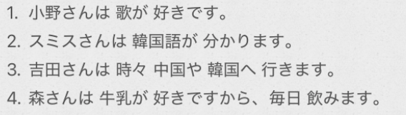

# 3-11  
* 表达感情的形容词  
* 表达能力  
* や：不完全列举  
* から：表原因理由  
  
  
- [ ] ****表达感情的形容词****  
「名1」は「名2」が「形」です  
*   
  
- [ ] ****有关能力的词语****  
「名1」は「名2」が「形」です/「动」ます  
  
  
- [ ] ****不完全列举：～や～や〜など　****  
  
  
- [ ] ****～から、だから****  
“から"都须接在表示原因、理由小句的句尾。==から前面必须是完整的句子==  
  
连词：だから   
  
  
  
- [ ] ****表示事件的名词，用「で」****  
  
  
  
  
- [ ] ****单词****  
* n  
    * うた　歌							歌；歌曲  
    * バラ　薔薇						玫瑰  
    * べっそう　別荘					别墅  
    * もよう　模様						花纹；纹案  
    * ぼく　僕							我【代，男性自称】  
    *   
    * うんてん　運転					驾驶；开车「自他动·サ变」  
  
* v  
    * わかる　分かる					懂；明白「自动·五段」  
    * できる							会；能；完成「自动·一段」  
    * まよう　迷う						犹豫；难以决定「自动·五段」(记忆：麻药、肯定要迷了)  
    *   
  
* adj  
    * こわい　怖い						害怕；恐怖  
    * いたい　痛い						疼；疼痛  
    * じょうず　上手					擅长；高明；水平高  
        * とくい　得意　　擅长；拿手  
    * へた　下手						不高明；水平低  
    * にがて　苦手						不擅长；不善于  
    *   
  
* adv  
    * たまに　偶に						偶尔；很少  
    * どうして							为什么  
        * どうしてですか				  
  
* 连词  
    * だから/ですから					所以； 因此  
  
* 语句  
    * けっこうです　結構です			不用；不要  
    * きにいります　気に入ります			中意；喜欢		  
    * など　等							…等等  
        * ~や~や~など  
  
