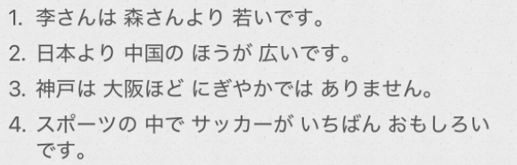

# 3-12比较/范围  
  
  
  
- [ ] ****比较****  
  
* ****より＋肯定形容词****  
- ～は〜より「形」				～比～更加（形）  
- 〜より、〜==のほう==が「形」		比起～，～一方更加（形）  
  
==～の方==  
  
  
* ****ほど＋==否定==形容词****  
- 〜は〜ほど「形否定」  
  
  
- [ ] ****で标记范围****  
  
  
- [ ] ****表示2种的范围：〜と〜と****  
  
回答时：  
* ==～の方xxです==  
* ==どちらもxxです==  
  
- [ ] ****询问三种以上的范围的哪一个：どの名/特殊疑问词 「が」一番「形」ですか****  
  
  
- [ ] ****单词****  
* n  
    * つき　月						月份  
    * ウーロンチャ　烏龍茶			  
    * りょくちゃ　緑茶  
    * ナシ　梨	  
    * しゅるい　種類				种类；类别		  
    * せ　背						背部；身高；个头  
    * さいきん　最近				最近「名·副词」  
    * ほう　方						方向；方法；方面；立场；一方  
  
* v  
    * ふる　降る					下（雨、雪等）；降临；发生「自动·五段」  
        * 记忆：ふ有轻飘飘(ふわふわ）的感觉，ふる——动作化，飘轻轻的东西——下雨/雪  
  
* adj  
    * わかい　若い					年轻(记忆：かわいい可爱　わかい年轻)  
  
* adv  
    * ずっと						远比；更加  
    * やはり・やっぱり				果然；毕竟；仍然  
  
* 语句  
    * 〜年間							一年；全年  
  
  
