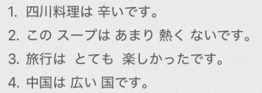

# 3-9　い形容词  
  
- [ ] ****形容词：****  
* 用于修饰名词  
* 用于做谓语，+「です」  
  
- [ ] ****一类形容词****  
词干+「い」词尾。  
  
- [ ] ****作谓语时，四种形态：==先否定，再过去==****  
  
****ないです = ありません****  
  
- [ ] ****「を」→「は」****  
将“名を动"中表示动作对象的“を"替换为“は"，可以==将"を"前的名词当作话题或用其进行对比==。  
如“コ-ヒ一を 飲みます(喝咖啡)"中的“を"替换为“は"，构成"コ-ヒ一は飲みます"。  
这时候原来的“を"必须去掉，不能变成“xをは"的形式。  
==“に/で/へ/から/まで/と”是可以+は，を不能==  
  
  
- [ ] ****表示程度的副词****  
注意：==あまり后面一定要跟否定词==。表示程度不高。同样的：==ぜんぜん＋否定==  
  
什么是副词：修饰动词/形容词等，表示状态、程度等  
  
补充：ほとんど：几乎（偏多、接近全部）可肯定可否定  
  
  
- [ ] 表示频率  
1. いつも：总是、一直  
2. よく：经常、常常  
3. 時々（ときどき）：时常、时不时  
4. たまに：偶尔  
5. めったに～ない：很少、几乎不（否定搭配）  
6. 全然（ぜんぜん）～ない：完全不、根本不  
一句话速记：  
==いつも ＞ よく ＞ 時々 ＞ たまに ＞ めったに～ない ＞ 全然～ない==  
  
- [ ] ****多い、少ない　不能单独修饰名词****  
  
  
- [ ] ****单词****  
* n  
    * おゆ　お湯					热水；开水  
    * ゆかた　浴衣					浴衣；夏季和服  
    * ながめ　眺め					景色；风景（记忆：远（ながい）看（め）　）  
    * じょせい　女性				女性  
    * だんせい　男性				男性  
    * お客様						来宾  
    * きもち　気持ち				心情  
    * すきやき　すき焼き			寿喜烧；日式牛肉火锅  
  
* adj  
    * からい　辛い					辣  
    * しおからい　塩辛い			咸（记忆： 盐（しお）多了感觉辣（からい））  
    * しょっぱい					咸  
    * すっぱい　酸っぱい			酸  
    * すばらしい　素晴らしい		极好；绝佳  
    * おおい　多い					多  
    * すくない　少ない				少  
  
* adv  
    * ちょうど						正好；恰好  
  
* 语句  
    * 気持ちがいい					感觉舒服；心情愉快  
    * 〜よう　〜用					  
  
  
  
  
  
