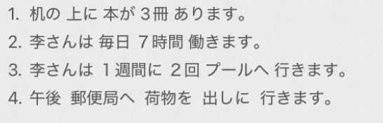
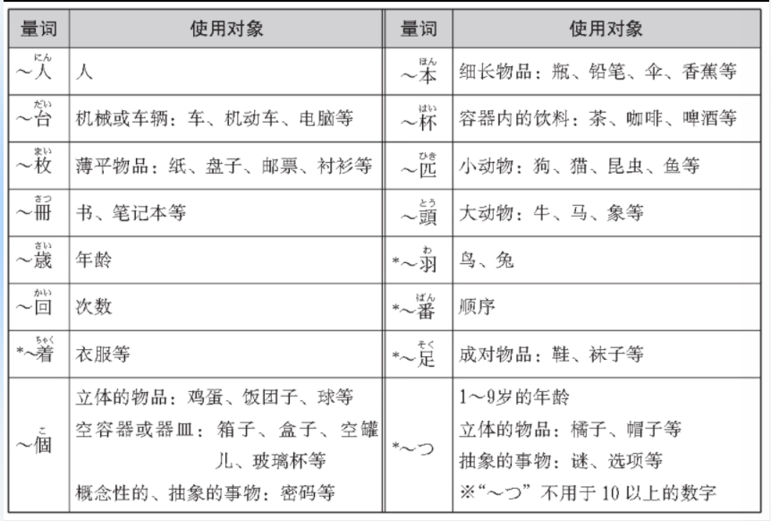
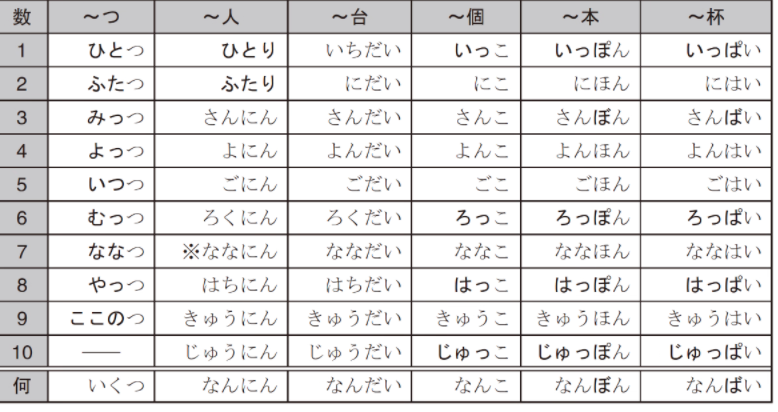
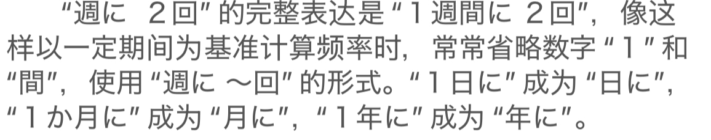
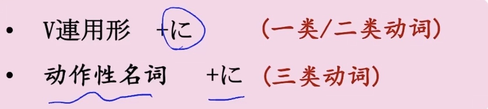

# 4-13表达数量  
  
  
  
- [ ] 名[数量] + 动  
  
- [ ] ****量词****  
  
==重点：==  
〜つ  （和数词， 日本原有的数字）  
〜人  
〜個  
〜回  
〜本  
〜冊  
〜番  
  
注意：1,3,6,8,10容易发生音变  
  
- [ ] 名[时间段] + 动  
表示时间数量的词语和动词一起使用，表示动作、状态的持续时间。这时候表示时间数量的词语后面不能加"に。  
～時間  
～週間  
==～ヶ月（〜かげつ）（間）==  
～  
  
  
这里的「ヶ」其实是个符号，代表「箇（个）」，所以读音是 **か**  
注意：时间点和时间段的区分：
**3月 (さんがつ)**：三月份（March）。  
**3ヶ月 (さんかげつ)**：三个月的时长（3 Months）。  
  
- [ ] 名[时间段] ==に== 名[次数]+ 动  
表示在一定时间内进行若干次动作  
  
  
当「月」作为一个独立的对象（天上的月亮）或者抽象的概念（月份）存在时，它的读音是 ==つき==  
  
- [ ] ****ます型的==连用形==+に****==表移动的目的==  
  
==一类二类动词：去掉ます==  
==三类动词：==  
  
  
  
- [ ] ****数量+で：表基准****  
  
数量大于1时使用  
  
  
- [ ] ****单词****  
* n  
    * にもつ　荷物					包裹，行李;货物  
        * 荷物を出します			寄包裹  
        * 荷物を送ります           		寄包裹  
    * はがき　葉書					明信片  
        * 書く的连用形作名词  
    * きって　切手					邮票  
    * しゅうり　修理				修理；维修  
    * いざかや　居酒屋  
        * 居 い = 家 いえ  
        * 酒 さか  
        * 屋 や  
    * 生ビール  
    * やきとり　焼き鳥  
    * からあげ　唐揚げ  
    * ひる　昼						白天；中午  
  
* adv  
    * だいたい　大体				大约；大概；大体；  
    * とりあえず	取り敢えず		暂且  
    *   
  
* 语句  
    * ==どのぐらい==かかりますか	询问需要花费多久/多少钱  
        * 询问价格也可以：いくら ですか			  
