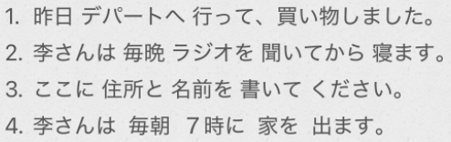
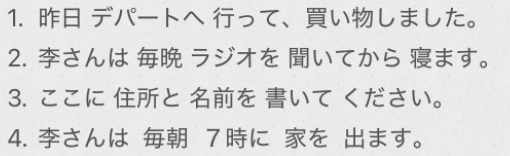
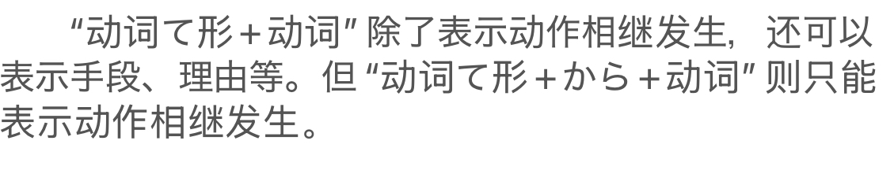
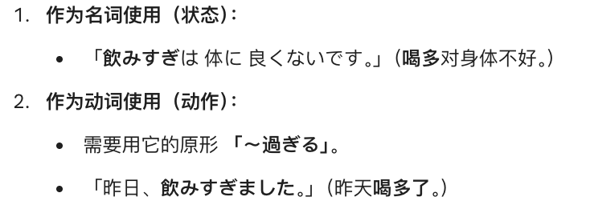

# 4-14て型  
  
  
- [ ] ****原型****  
* ****动词分类****  
  
  
* ****区分一类/二类动词****  
  
  
注意：二类动词的一定是【i/e+る】结尾。但是【i/e+る】结尾的不一定是二类动词。  
只是绝大部分是二类动词，有==奸细（看着像二类，其实是一类）==需要特殊记忆：  
    * かえる　帰る  
    * はいる　入る  
    * はしる　走る  
    * いる  
        * 入る  
        * 要る  
    * しる　知る  
    * すべる　滑る  
  
  
****==规律：通过原型来判断是几类动词？==****  
* 一类动词尾部只有一个假名  
行く　  
買う	  
飲む  
滑る：如果是二类动词，就会写成滑べる，尾巴多一个假名突出い和え段。  
  
* 二类动词：==る前面多一个い和え段的假名，用于标记是二类动词==  
食べる  
開ける  
点ける  
  
  
  
- [ ] ****て型****  
  
  
****一类动词：****  
==うつる==		促音变：尾巴变==って==  
==むぶむ==		拨音变：尾巴变==んで==  
==くぐ	==		い音变：尾巴变==いて、いで==  
==す==					尾巴变==して==  
  
特殊例外：行く　—>　行って  
  
* ****[动1]て[动2]****  
    * 依照时间顺序相继发生  
    * 手段，理由  
  
* ****[动1]てから[动2]****  
    * 依照时间顺序相继发生  
    * ～てから 不能重复使用  
  
* ****「动」て ください****  
    * 请求某人做某事  
  
- [ ] ****「名·场所」==を==「动·经过/离开」****  
* 经过场所  
    * 通る  
    * 渡る  
    * 過ぎる  
    * 曲がる  
  
* 离开场所  
    * 出る（注意这是一段动词）  
    * 卒業する  
  
****==注意：一般自动词确实不能带「を」宾语。日语里有一种特殊的自动词，它们后面会跟着 を。==****  
**==但这时的 を 不是表示“宾语（被处理的对象）”，而是表示 “经过的路径或离开的起点”。==**  
  
  
  
- [ ] ****词语****  
* ****それから****  
    * 用于句子的连接  
  
* ****〜が　できました****  
    * 动词“できる”除了表示能力，还可以表示“完成”。  
  
* ****なかなか****  
    * 表示程度的副词  
  
* ****〜て　ください==ませんか==****  
    * +ませんか。表达更礼貌的请求  
  
* ****もう****  
    * 已经： 句尾～ました  
    * 马上，就要： 句尾～ます  
    * 再，还，另外  
  
* **文脉指示词：==そうして==　ください	**  
*   
*   
*   
  
* ****お金を下ろします****  
  
  
  
- [ ] ****单词****  
* n  
    * ふなびん　船便				船运；海运  
    * しょるい　書類				文件; 文档; 资料  
    * げんこう　原稿				草稿；原稿  
    * きじ　記事					报道；文章；记事  
    * メモ							笔记；备忘录；记录  
    * えきまえ　駅前				站前  
    * かど　角						角落；拐角；棱角  
    * おうだんほどう　横断歩道		人行横道；斑马线  
    * こうさてん　交差点			路口；交叉口；交汇处  
    * でんき　電気					电，电气；电灯  
    *   
    * みせる　見せる　				给……看；让……看；表示，显示「他动·一段」  
    * そつぎょう　卒業　　			毕业「名·自他动·サ变」  
    * しょくじ　食事　　			餐，食物；吃饭，进餐「名·自动·サ变」  
    * せいり　整理　　				整理「名·他动·サ变」  
    * コピー　						复制；复印；副本；拷贝「名·サ变」  
  
* v  
    * とおる　通る　				通过；穿过；通过（审查、测试等）「自动·五段」  
    * わたる　渡る　				渡过；横穿；经过「自动·五段」（记忆：欲渡人，先渡己（わたし））  
    * すぎる　過ぎる　				过；经过；超过；过度「自动·一段」  
        * ==[连用形/词干] + ****過ぎ**** ==。 动词「過ぎる」的名词化形式。 表示：过度 / 太……  
        * 食べすぎ (吃多了)  
        * 面白すぎ(太有趣了 )  
        *   
  
    * まがる　曲がる　				弯曲；拐弯；歪斜；转向「自动·五段」（记忆：向++MAGA++转弯）  
    * いそぐ　急ぐ　				赶快；匆忙；加紧「自他动·五段」（记忆：忙しい的++いそ++，忙了就很快很急）  
        * 急いで					 急忙地，赶快地；adv.  
    * とぶ　飛ぶ　					飞；飞翔「自动·五段」（记忆：++特步++ 飞一般的感觉）  
    * しぬ　死ぬ　					死亡；去世「自动·五段」（记忆：没有++喜怒++的人跟死了一样）  
    * まつ　待つ　					等待「他动·五段」  
    * うる　売る　					卖；出售「他动·五段」  
    * はなす　話す　				说；谈；告诉；商量「他动·五段」  
    *   
    * おろす　下ろす　				放下；卸下；取下；提取「他动·五段」（记忆：++俄罗斯++）  
    * おりる　降りる　				下来；下车；降落「自动·一段」（记忆：++噢利率++ 降下了）  
        * 降りる	用于：下车，下山  
        * 降る		用于：下雨，下雪  
    * えらぶ　選ぶ　				选择；挑选「他动·五段」（记忆：++爱辣不？++ 选择你喜欢的菜）  
        * せんたく　選択	「名·他动·サ变」  
    *   
    * でる　出る　出て				出去；外出；超出；毕业「自动·==一段==」  
    * でかける　出かける　			出门；离开家	「自动·一段」  
        * [出る] = 出（单纯的位移，从 A 到 B）。  
        * [出かける] = 外出（有目的的行程，去外面玩/办事）。  
            * **记法：** 「出かける」比「出る」长，因为它的**路程更长、目的更多**。  
    *   
    * あく　開く								开（状态）「自动·五段」  
    * しまる　閉まる							关（状态）「自动·五段」  
    * あける　開ける　				打开（门窗等）「他动·一段」  
    * しめる　閉める・締める			关闭（门窗等）「他动·一段」  
    * つける　点ける　				打开（电器等）；点燃；开启「他动·一段」  
    * けす　消す　					关闭（电器等）；消除「他动·五段」  
    *   
  
* adj  
    * たいへん　大変		　				重大，严重、厉害，不得了，了不得、非常，太  
  
  
* adv  
    * なかなか　中々		相当；很；不容易（形容超出想象。）  
    * こう					这样；如此  
    * そう/ああ			那样  
    * それから				然后；另外；以及  
        * これから			从今以后；从现在起  
        * これまで			迄今为止  
  
* 语句  
    * すみませんが							对不起….，劳驾….  
    * 部屋の角を右へ曲がって				房间的角落向右转  
        * を　转弯的通过/路过的空间  
        * へ/に  转弯的方向  
        * 省略了ください   
  
  
  
- [ ] ****==开关总结==****  
1. 空间与物理的“开/关”（门、窗、书）这一组动作是**物理上位移**，让原本封闭的空间产生缝隙。  
  
  
2. 电器与火光的“开/关”（灯、电视、空调）这一组动作是**能量的接通或切断**，不涉及物理上的“位移”。  
  
  
  
  
  
  
  
  
  
  
  
  
