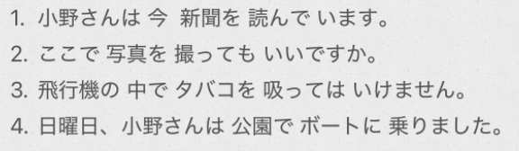

# 4-15　て型  
  
- [ ] ****动作正在进行****  
「动」て==います==  
  
〜て==い==ます　有时候会缩略==い==　—>　〜てます  
  
- [ ] ****动作许可****  
「动」て ==も いいです==		表：做什么动作可以  
  
  
「动」て ==も かまいません==			表：做什么动作没关系/不介意  
🌰：遅れても、かまいません。  
  
- [ ] ****动作禁止****  
「动」て ==は いけません==  
* は:强调  
* いけません:不行，不可以  
  
- [ ] ****に 附着点****  
表示人或物体的附着点，即人或物体停留在交通工具或椅子上等时，附着点用助词“に"表示。  
==〜に＋乗る/座る/入れる，触る==  
  
- [ ] ****に 目的地****  
移动行为的目的==地，==既可以用“へ”表示，也可以用“に"表示。只有表示下面等典型的移动行为的目的地时，“に"和“へ" 才可以通用。  
==〜に＋行く/来る/帰る==  
  
  
  
- [ ] ****单词****  
* n  
    * し==やく==しょ　市==役==所				市政府  
    * けいたいでんわ　携帯電話  
    * ==きん==えん　==禁==煙  
    * すいみん　睡眠「名·自动·サ变」  
    * やっきょく　薬局  
        * やく　薬(音读)  
    * ひ　火  
    * き　気							精神；意识  
    * うちあわせ　打ち合わせ			商洽；事先商量  
    * むり　無理						勉强；难以办得  
    * ちゅうしゃ==きんし==　駐車==禁止==  
    * たちいりきんし　立入禁止			禁止进入  
    * さつえいきんし　撮影禁止  
        * 记忆：拍++撒子挨++？  
  
* v  
    * はいる　入る						入；进入；容纳；得到「自动·五段」  
    * もうす　申す						说；讲；告诉；叫做「他动·五段」(记忆：会说话的++moss++)  
        * 私わ～と申します  
        *   
「申す」是动词「言う（说）」的自谦语。  
用于说话人向听话人（地位较高者）表达“自己说话”的行为时，表示尊敬对方、谦逊自己。  
翻译成中文可以理解为：“说（谦逊地）”、“敬启”、“禀告”等。只能用于“自己”或“己方”的动作，不能用来描述对方说话的动作。对方“说”的尊敬表达是「おっしゃる」。自己“说”的谦逊表达是「申す」。  
    * ==とる　==							拿；取；采取；获得；记录；拍摄；选择；夺取「他动·五段」  
    * つたえる　伝える					传达；传递；传授；传播「他动·一段」(记忆：++赐他爱噜++，传达（爱意）)  
    * とめる　止める					制止；阻止；使（交通工具等）停「他动·一段」  
        * とまる　「自动·五段」  
            * 止まる　停止；停留  
            * 泊まる　停留；住宿  
  
* adj  
    * だめ								不行;不可以;  
  
* adv  
    * じゅうぶん　十分					好好地；充分地  
    * ゆっくり							好好地；安静地；  
  
* 语句  
    * どうしました						怎么了？  
    * おだいじに　お大事に				请多保重  
    * いけません						不行，不可以  
    * かまいません						没关系，不要紧（卡蚂蚁ません）  
        * 相当于：大丈夫です  
        * かまう　構う					关心；在意；有关系  
    * まだです							还没有，仍然…..没有  
    * 気をつけます						注意  
    * 無理をします						勉强  
    * 睡眠をとります					睡觉（とる 摄取睡眠）  
    * お風呂==に==入ります					洗澡（に 动作附着点）  
  
  
  
  
  
