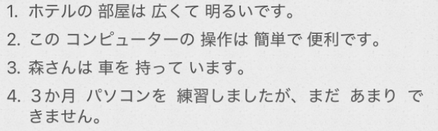

# 4-16 形容词て型  
  
- [ ] ****形容词并列****  
* ****一类形容词て型****  
    * い —> ==くて==  
* ****一类形容词て型****  
    * 直接➕==で==  
  
- [ ] ****名词并列：****==で==  
两个及以上的名词并列使用时，用“[名词1]==で==[名词2]”的形式连接。  
  
  
- [ ] ****「动」ています：动作结束后留下的结果状态****  
上节课学的是可以表示【动作的正在进行】；  
  
〜て==い==ます　有时候会缩略==い==　—>　〜てます  
  
  
- [ ] ****「名1」は「名2」が「形」です****  
  
  
- [ ] ****「句子」==が==、「句子」  ：表转折****  
意思相当于“但是，可是”；が的前面必须是个完整的句子。（和から表原因一样～）  
  
  
  
  
  
  
- [ ] ****单词****  
* n  
    * そうさ　操作					操作；操纵  
    * きかい　機械					机械；机器  
    * せいひん　製品				产品  
    * けんちくか　建築家			建筑师  
        * ちく　築　竹  
    * せっけい　設計				设计  
    * デザイン						设计  
    * かたち　形					造型；形状；形式  
    * さいしん　最新				最新  
    * かわ　革						皮革  
    * ぬの　布						布，布匹  
    * すいとう　水筒				水壶；水桶  
    * あし　足						脚  
    * かお　顔						脸；颜面  
    * ゆび　指						手指；指头  
    * あたま　頭					头；头脑  
    * まちがい　間違い				错误；失误  
        * ちがい　違い		名词：差异；不同；区别  
    * かんばん　看板				牌子  
    * てんじじょう　展示場			展览会场  
    * サービス						服务  
    * おんなのこ　女の子			女孩  
    * よこ　横						旁边；侧面  
  
* v  
    * もつ　持つ					拿；有；拥有；持有「自他动·五段」  
    * しる　知る					知道；了解；认识；懂得；察觉「他动·五段」  
    * なおす　直す					修理；改正；修改；翻译；矫正「他动·五段」  
    * かたづける　片付ける			整理；收拾；清理「他动·一段」  
        * かた　方、肩、片、型  
    * あんしん　安心				放心；安心；无忧无虑「名·形动·自动·サ变」  
    *   
  
* adj  
    * ほそい　細い					小；细小  
    * ふとい　太い					粗；胖  
    * はで　派手					谣言；花哨（有点土气的感觉）  
    * じみ　地味					朴素；质朴  
    * げんじゅう　厳重				森严；严格  
    * たいせつ　大切				重要；珍贵(记忆，太奢侈，珍贵)  
    * ふくざつ　複雑				复杂；繁杂  
  
* adv  
    * ちゃんと						好好地；的确；完全  
    * すぐ							马上；立即  
    * ずいぶん　随分				相当；非常；很  
        * 表示程度高(无论是正面或负面)，用于表示程度大幅度地超过了说话人自身认知或者一般性的评判标准。  
  
* 语句  
    * ほら							你看（用于提醒别人注意）  
    * あたまがいい　頭がいい		脑子好；聪明  
    * ~製/~料/~費/~代  
