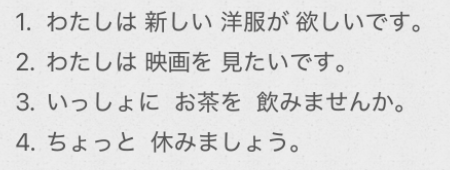

# 5-17  想要/建议/邀请  
  
  
  
- [ ] ****想得到某物****  
～は〜が==欲しい==です  
  
  
- [ ] ****想做某事****  
〜は〜を==「动」たい==です  
  
  
  
- [ ] ****提出建议邀请，要不要做某事？****  
* ==「动」ませんか==  
  
  
* ==「动」ましょう==  
礼貌程度不如 ませんか  
  
  
- [ ] ****疑问词+でも****  
  
  
  
- [ ] ****「时间」中に****  
表示该期间结束之前  
  
  
- [ ] ****单词****  
* n  
    * ようふく　洋服			西服；西装	  
    * バイク					摩托车  
    * はつもうで　初詣			初次参拜  
        * はつ　初  
        * もうでる　詣でる  
    * こいびと　恋人			恋人；情人；对象  
        * こい　恋　濃い　故意  
    * あいて　相手				对手;伙伴;对象;对方  
    * せんぱい　先輩			前辈；学长；师姐  
    * だんせい　男性  
    * じょせい　女性  
    * がいこくじん　外国人  
    * ことし　今年				  
    * 今度						==下次；这次==  
  
* v  
    * はじめる　始める			开始「他动·一段」  
    * れんらく　連絡			联系；联络「名·自他动·サ变」  
  
* adv  
    * ぜひ　是非				务必；一定；无论如何  
    * たくさん					多；许多；大量　==「名·副词」==  
  
* 语句  
    * 〜中に					在…之中/期间  
  
  
  
  
  
  
