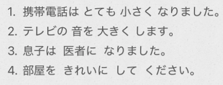
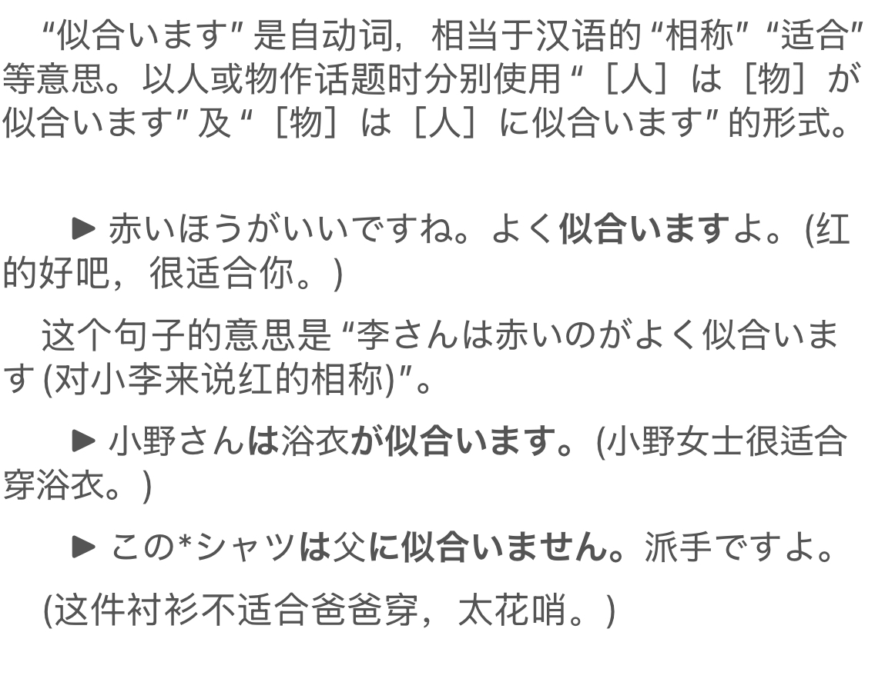
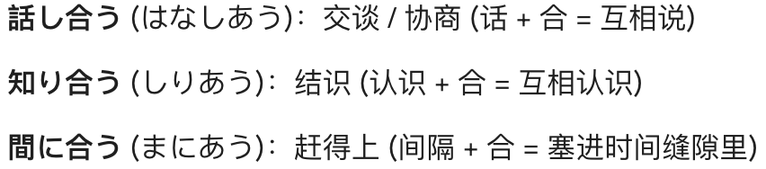
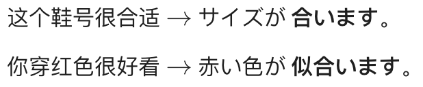
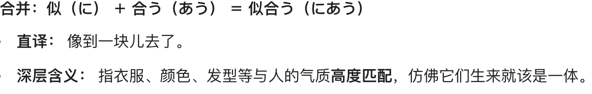

# 5-18 变化/形容词变副词/自动/他动词  
  
- [ ] ****表示变化的动词****  
* ==なる==：陈述客观的变化结果  
* ==する==：强调变化的人为性  
  
  
  
- [ ] ****小火车：形容词/名词 + 动词****  
因为形容词不能直接修饰动词。而副词可以修饰动词。所以需要把==形容词作为副词==。  
* 一类形容词：==い变く==＋V  
* 二类形词/名词：==に==＋V  
  
  
  
- [ ] ****ほう： 形式名词****  
之前学的「名词」の方；这里「形」の方。这里就是==把ほう作为名词使用==。  
个人理解：这样形容词就可以间接做主语啦～  
  
  
  
  
- [ ] ****自动/他动****  
  
  
  
- [ ] 似合います  
* が似合います  
* に似合います  
  
  
- [ ] ****单词****  
* n  
    * おと　音					声音（无生命的声音， sound）  
    * こえ　声					声音（有生命的声音， voice）  
    * くうき　空気  
        * 空気を読む		有眼力见  
    * おじょうさん　お嬢さん	令爱；大小姐		  
        * お嬢様  
    * しゃかいじん　社会人		社会的一员；成人  
    * がくしゃ　学者  
    * パイロット				飞行员（pilot）  
    * 旅行ガイド				旅行导游（guide）  
    * デザイナー				设计师  
    * しんしゅん　新春			新年  
    * ねんまつ　年末			年末  
    * おしょうがつ　お正月		新年；过年  
    * わりびき　割引			折扣off（例如：３割引； 30%off， 7折）  
        * 割り　比例，分开，分摊  
    * はんがく　半額			半价  
    * ていか　定価				定价  
    * しょうらい　将来			  
    * びょうき　病気			疾病  
  
* v  
    * ==なる	==					成为；变成；组成；达到；到「自动·五段」  
    * する						使某种状态变化  
    * にあう　似合う			合适；般配；相称「自动·五段」（侧重点：气质/外观）  
        * にる　似る　相似；类似「自动·一段」  
        * あう　合う　适合；一致；符合「自动·五段」（侧重点：尺寸/对错， “后缀动词”，经常用来表示“互相”或“匹配”。）  
        *   
        *   
        *   
  
    * ==はじまる　始まる			开始；发生；启动「自动·五段」==  
    * ==はじめる　始める			开始; 启动; 着手「他动·一段」==  
  
* adv  
    * まもなく　間もなく  
    * もうすぐ  
*   
    * さらに　更に　　　　　更进一步，而且，再者（你再进一步，我就++杀了你++）  
    * もっと  
    *   
  
* 语句  
    * さあ　　　　　　　　　叹词。(表示劝诱或催促对方做某事)  
        * さあ、行きましょう  
    * できるだけ				尽量；尽可能  
    * まとめて					一起；汇总；汇集　马冬梅て  
        * 马冬梅る的原型：まとめる　纏める　总结；整理；归纳；解决；完成「他动·一段」  
  
  
  
  
  
  
  
  
  
  
  
  
  
