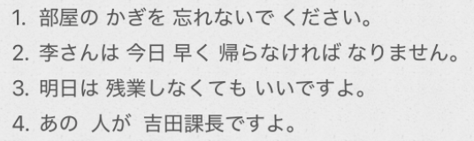
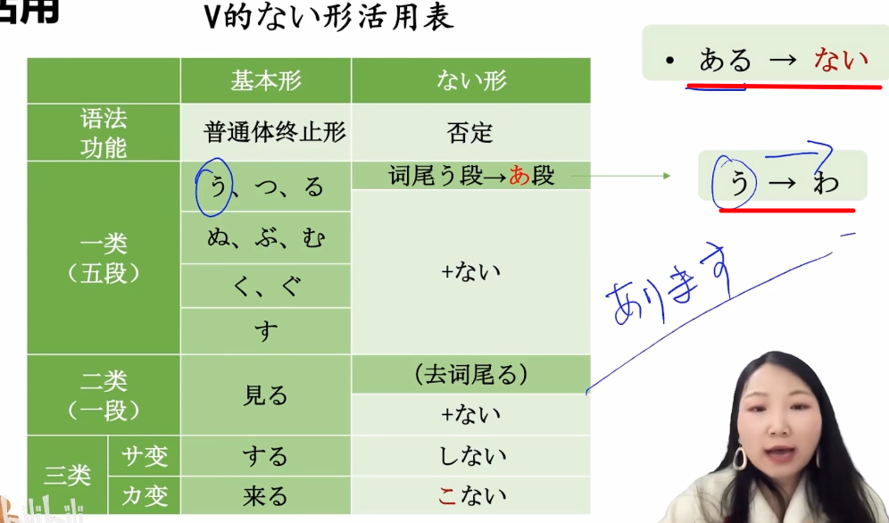

# 5-19 ない形  
  
- [ ] ****核心：****  
  
  
- [ ] ****ない形****  
  
特殊：  
* う变わ		例如：買う 变 買わない  
* ある —> ない  
  
  
  
  
- [ ] ****「动」==ないで==ください****  
  
  
  
  
  
- [ ] ****「动」なければなりません****  
  
  
或者：  
  
  
  
- [ ] ****「动」==なくて==もいいです****  
  
ない：表否定，看作形容词活用  
  
  
  
  
  
- [ ] ****が 提示新信息****  
所以一般是疑问词+が   
* が：新信息  
* は：旧信息  
  
  
  
- [ ] ****单词****  
* n  
    * しなもの　品物						物品；商品  
        * しな　品　　　　　　　　　　　　物品；商品；品质；种类  
    * しょしんしゃ　初心者					初学者  
    * ==じょうきゅうしゃ==　==上級者==				熟练者  
    * こうきゅう　高級						高级  
    * コース								路线；跑道（course）  
    * レポート								报告  
    * のど　喉								喉咙  
    *   
    * ざんぎょう　残業						加班「名·自动·サ变」  
    * しんぱい　心配						担心；忧虑；操心「名·形动·自他动·サ变」  
    *   
  
* v  
    * さわる　触る							触摸；接触「自动·五段」（记忆：++傻娃++别碰我）  
        * 附着点，用に  
    * はこぶ　運ぶ							搬运「自他动·五段」（记忆：搬运　++箱子(はこ)不++？）  
    * ころぶ　転ぶ							摔；摔倒；跌倒「自动·五段」（记忆：跌倒 ++磕了不++？）  
    * かわく　渇く							渴；渴望，渴求「自动·五段」（记忆：渴望 ++可爱到哭++）  
    * なおる　治る							痊愈；医好「==自动==·五段」  
        * 记忆：直る　					恢复；改正「自动·五段」  
    * なおす　治す                                      		  治好，医好「==他动==·五段」  
        * 记忆：直す					修理；改正「他动·五段」  
    * ==すべる　滑る							滑；滑行（奸细）==「自动·五段」（记忆：从 ++四百楼 ++滑下去）  
    * よぶ　呼ぶ							叫；称呼；呼喊；引起「他动·五段」（记忆：++哟,不++和我打招呼？）  
        * 名前を呼ぶ　  
    * かえす　返す							归还；返回；回敬；翻转「==他动==·五段」  
        * 返る			归还；返回「==自动==·五段」  
        * 帰す			使返回；让回家「他动·五段」  
        * 帰る			返回；回家「自动·五段」  
  
    * てつだう　手伝う						帮忙「自他动·五段」（记忆：++太次的我++ 需要帮忙）  
    * なくす　失くす						丢失；遗失；丧失「他动·五段」（记忆：丢了 ++那哭死++）  
    * おとす　落とす						使掉落；遗漏；降低；失掉「他动·五段」（记忆：++我脱丝++）  
    * おく　置く							放置；留下「自他动·五段」  
    * はしる　走る							跑；奔跑「自动·五段」（记忆：跑过++桥（はし）++）	  
        * あるく　歩く						走；步行「自动·五段」（记忆：++啊 路苦++，走路太苦了）		  
    * たつ　立つ							站；立「自动·五段」（记忆：++touch++ 一下就立）	  
    * あわてる　慌てる						惊慌；慌张；着急「自动·一段」（记忆：++啊瓦特了++，慌了）  
  
  
* adj  
    *   
  
* adv  
    * やっと								好不容易；终于  
    * だいぶ	大分						很；相当的（记忆：++逮捕++）  
        * 今日はだいぶ寒いですね  
①「とても」：单纯表示“很”“非常”，无额外语气。   
广泛用于口语和书面语，后不可接否定   
②「ずいぶん」：程度高且带有惊讶、超出预期、感叹或负面情绪。    
多用于口语，后可接否定  
③「だいぶ」：表示程度与之前相比发生了较大的变化或进展，强调过程，多用于积极或中性事件。  
口语和书面均可，后可接否定  
④「かなり」:表示程度明显高于正常水平，客观性较强，语气正式、强硬。多用于书面语或正式场合，后可接否定  
  
    * 初めて								第一次  
    * さきに　先に							先  
  
* 语句  
    * 心配しないで（ください）　　　　　请不要担心  
    * 無理を しないで ください		请不要勉强  
    * 喉が渇く　　　　　　　　　　　　口渴了  
  
  
