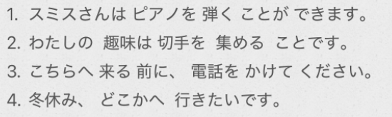

# 5-20　动词基本型 + 名词  
  
- [ ] ****名词化：动词基本型 + こと****  
* こと(事):形式名词，==将短语等名词化。==  
小野さんは==車を運転する==ことができません  
  
  
  
- [ ] ****名词化：动词基本型 + 前に****  
* 表示后项动作在前项动作之前发生，意思是“在~之前  
毎日==寝る==前に、電話をかけてください  
  
* 前项为名词时，接续形式为“名词+の+前に、~"  
==会議==の前に、散歩しましょう  
  
  
  
- [ ] ****本质：动词基本型+名词****  
* ****可以将[动作/动作短语]进行名词化****  
  
  
* ****==动词的『连用形』经常会变成名词　⚠️⚠️⚠️⚠️⚠️⚠️⚠️⚠️⚠️⚠️⚠️⚠️⚠️⚠️==****  
  
    * 通り <— 通る  
    * 乗り換え　<—  乗る　換える  
  
  
  
  
- [ ] ****疑问词+ か****  
  
* いつか  
* どこか　何処か  
* だれか　誰か  
  
- [ ] ****〜よね：征求对方同意 ****  
  
〜ね：更确定  
  
  
- [ ] ****で 提示主体样态： 限定动作发出者当时的数量、范围或样子。****  
* ****常见的“人数”限定（最常用）****  
家族で：全家人一起做。  
  
* ****描述主体的“身心状态”****  
急いで 部屋を 出ます。（急忙走出房间。）  
  
  
  
  
    - [ ] ****单词****  
* n  
    * しゅみ　趣味						爱好(长期在做的事情)  
    * きょうみ　興味					兴趣(只是短期感兴趣，不一定要做)  
        *  今日（きょう）み。谐音记忆：“今天”的“味”，是短期的，仅限今天  
    * ==とく==ぎ　==特==技  
    * ゆめ　夢							梦；梦想；理想；幻想  
    * ギター							吉他  
    * ==しょ==どう　==書==道					书法  
    * つり　釣り						钓鱼；垂钓  
        * 连用形，动词原形：つる　釣る	钓鱼；引诱  
        * お釣り						找零；零钱  
    * あみもの　編み物					编织物；针织品  
        * あむ　编织  
        * あみ(连用形)＋物  
    * てつくり　手作り					手工制作；自制  
        * 手＋作り(连用形)  
    * ちゅうかりょうり　中華料理  
    * ==ちゅうか==がい　==中華==街  
    * ギョーザ　餃子  
    * しゅんせつ　春節					春节；农历新年  
    * おなか　お腹  
    * しりょう　資料  
    * しょうせつ　小説  
    * かいがん　海岸  
    * じぶん　自分						自己；本人；我  
    * ぜんいん　全員  
    *   
    * そうじゅう　操縦					操纵；驾驶；控制「名·他动·サ变」  
    * きこく　帰国						回国；归国「名·自动·サ变」  
    * ドライブ　ドライブ				驾驶「名·サ变」（drive）  
    *   
  
* v  
    * ひく　弾く						弹奏「他动·五段」  
        * 引く  
        * 退く  
    * すく　空く						饥饿；稀疏，空旷；有空闲「自动·五段」  
        * 好く  
    * のぼる　登る						上；上升；攀登；达到「自动·五段」（记忆：noble 高尚的，上等的）  
        * 上る	  
    * あつめる　集める					收集; 聚集; 召集「他动·一段」（记忆：あつ (暑)める(没噜)。暑热没了，可以集合了）  
        * 集==ま==る	「自动·五段」  
    * あびる　浴びる					浇；淋，照，晒「他动·一段」（记忆：啊 啤酒ビール）  
    * ごちそう　ご馳走　　　　　　别人的款待；宴席  
        * ご馳走する:请客，款待  
        * ご馳走さまでした:多谢款待  
  
* adv  
    * ==とく==に　==特==に						特别；尤其  
  
* 语句  
    * お腹がいっぱいです				我吃饱了  
    * お腹が空きました					我饿了  
    * ど　度　　　　　　　　　　　　　程度；度数；次；回  
    * 一度　　　　　　　　　　　　　　一次  
    * もう一度							再次；重新  
    * なんど　何度　　　　　　　　　　多少次，几次，多少度，几度  
    * 何度も							多次；屡次  
  
  
  
  
