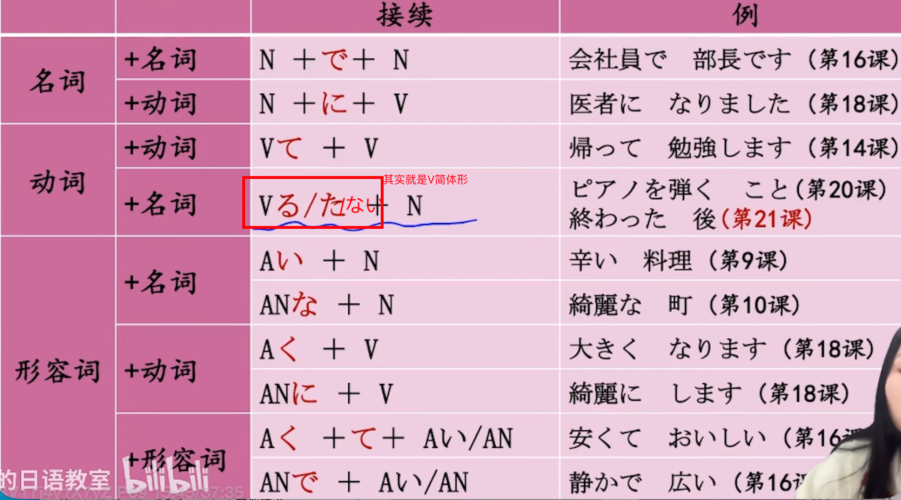
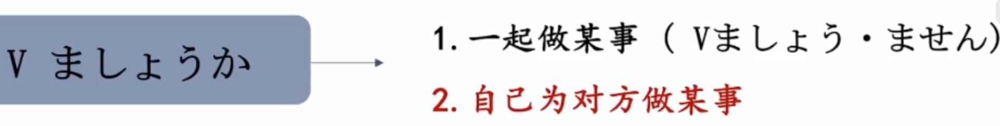

# 6-21　た形  
  
- [ ] ****た形，原型的过去式。****  
变形规律和て形一样  
  
  
  
  
    - [ ] ****た形：有某种经历/经验****  
  
こと（事）：形式名词，==名词化==  
  
  
- [ ] ****た形：~之后。相对时态****  
  
  
  
- [ ] ****た形：表示比较，并给出建议****  
  
ほう（方）：形式名词，==名词化==  
  
否定表达形式：  
  
  
  
  
- [ ] ****主动提出为对方做某事****  
  
〜ましょうか　建议的语气更柔和  
  
  
  
  
  
- [ ] ****单词****  
* n  
    * ことば　言葉						话，语言，言词  
    * メールアドレス					email adress  
    * れんきゅう　連休  
    * ==きゅうけい==じかん　==休憩==時間  
    * おわり　終わり					结束；终结；完毕。  
        * 終わる的连用形	  
    * からだ　体						身体；躯体  
    * じしん　地震  
    * どろぼう　泥棒					小偷;窃贼  
        * 泥棒猫  
        * まんびき　万引き				偷窃;顺手牵羊「名·他动·サ变」  
    * ちゅうしゃじょう　駐車場			汽车停车场  
        * ちゅうりんじょう　駐輪場		自行车停车场  
    *   
    * かんしゃ　感謝					感谢「名·サ变」  
    * せんたく　洗濯					洗涤；洗衣服「名·サ变」  
    * せんたく　選択					选择;挑选;选项「名·他动·サ变」  
    * ほうこく　報告					报告；汇报「名·他动·サ变」  
        * レポート  
        * こうこく　広告  
  
* v  
    * わたす　渡す						给；交给；渡；送过河「他动·五段」  
        * わたる　渡る						渡过；横穿；经过「自动·五段」  
    * かんがえる　考える				思考；考虑；认为（他动·一段）（记忆：看青蛙(かえる)🐸，考虑）  
  
  
* 语句  
    * どうして					为什么；为何  
    * それとも「连」				还是，或者  
    * そんなに					那么  
    * 一度も〜ません			一次也没～  
    * 〜過ぎ					表示“过度”、“太……”  
        * [连用形/词干] + 過ぎ  
        * 它是动词「すぎる」的连用形名词化形式  
  
  
