# 6-22 简体形  
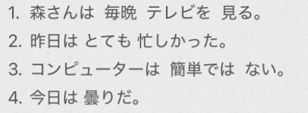  
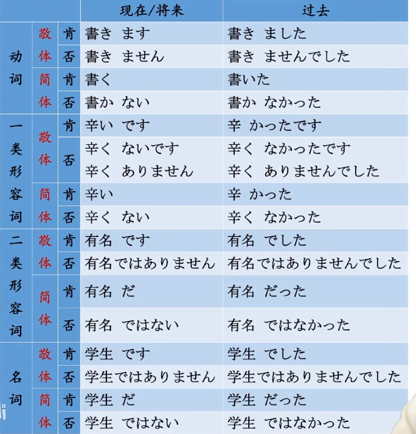  
- [ ] ****动词****  
本身就有敬/简体形：  
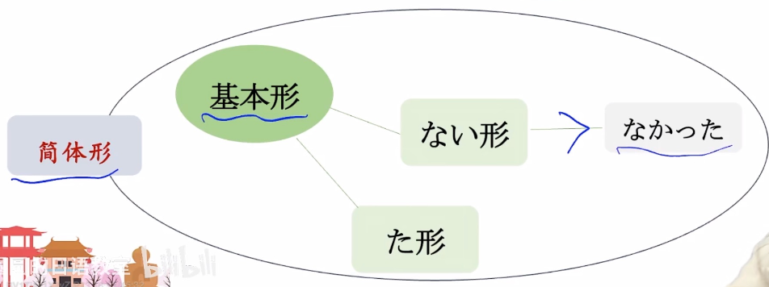  
  
注意：==ある的否定形是ない==，　所以ない的敬体形是ありません。所以==ないです = ありません==  
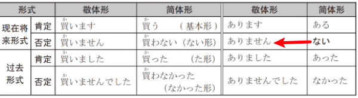  
  
- [ ] ****形1/形2/名词****  
只有在做谓语，只有在充当谓语时，其谓语形式才有敬/简体形  
* ****形1：去掉です****  
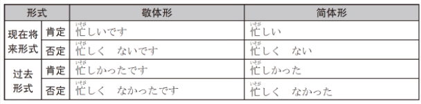  
～ありません ＝  〜ないです  
～ありません 的简体是 〜ない  
  
  
* ****形2/名词（一样）：****  
我们知道形2有个隐藏的小尾巴(だ)、名词也是借用(だ)来进行附加信息  
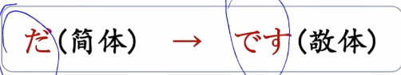  
- です						==だ==  
- でした					==だった==  
- ではありません			ではない	（りません的简体就是ない）  
- ではありませんでした　	ではなかった（先否定后过去，把ない作为形容词活用进行过去式）  
  
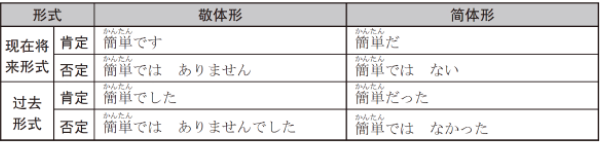  
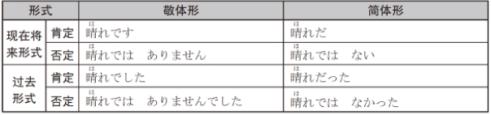  
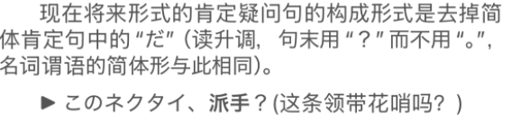  
  
  
  
- [ ] ****けど  ****  
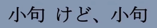  
同が、前面接完整小句子  
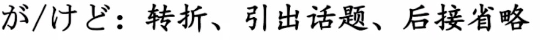  
  
  
  
- [ ] ****～方（かた）****  
==动词连用形+方==。表示==动作的方式/方法==  
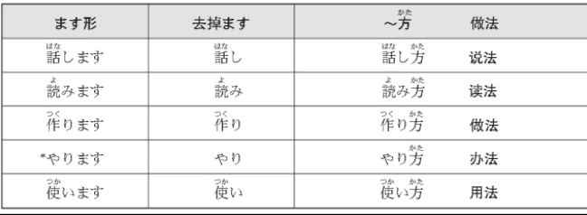  
  
- [ ] ****省略助词****  
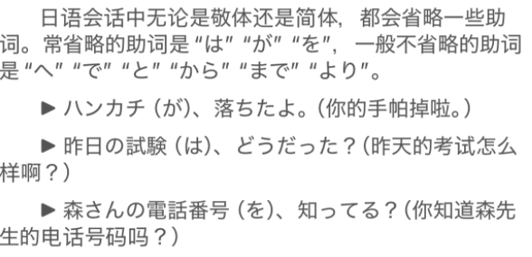  
  
- [ ] 〜てる  
〜て==い==る。て形表示正在进行/状态持续（15课）。有时候会缩略==い==　  
  
  
- [ ] ****单词****  
* n  
    * つごう　都合					情况；方便（记忆：++此狗++的情况不方便）  
        * ▲都合（つごう）         ①时间，场合，安排  
        * ▲具合（ぐあい）         ①人或事物；②时间　	*书面语，较正式  
        * ▲調子（ちょうし）      ①人或事物				*偏口语  
        * ▲体調（たいちょう）   ①人  
都：全都全部，表示全面整体的状态  
合：合并协调，表示一种协调、符合的状态  
都合：整体的协调状态。  
  
    * かじ　火事・家事				火灾;失火  
    * きかん　期間					期限；期间  
    * てんきん　転勤				调动工作  
    * けいたい　携帯				手机；携带「名·サ变」  
    * だいとうりょう　大統領		总统；元首；首领  
  
* v  
    * やる							做（同する、更口语化）；给；进行；派遣  
    * よろこぶ　喜ぶ　　　　　　　	高兴（记忆：++要乐可不++）  
        * よろこんで　				乐意地；非常愿意地；adv.  
  
* adj  
    * うれしい　嬉しい				高兴；喜悦（记忆：++吴磊洗衣++，让我很高兴）  
        * 嬉しい：表达【自己】因某个事件或行为而感到高兴；  
        * 楽しい：描述【活动】、【经历】本身的乐趣；  
        * 面白い：表达某件事或【内容】的趣味性。（例如故事、书籍、电影等）引人注意或让人觉得有意思。  
    * きゅう　急					紧急；急促  
        * きゅう==きゅう==しゃ　救==急==車（Q==Q==车）  
    *   
  
* adv  
    * あんまり						（同あまり）不太；不怎么；过于；过分  
  
* 语句  
    * ごめん						对不起；抱歉；请原谅（口语化）  
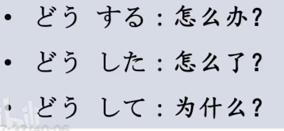  
  
  
  
  
  
  
  
  
  
  
