# 6-23　简体形-应用  
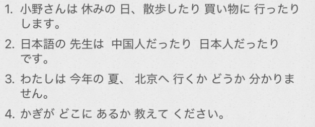  
- [ ] ****过去简体形 た —> ==たり==****  
  
* ==动作的列举==  
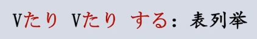  
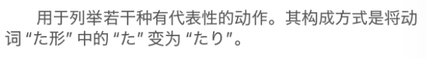  
  
* 形1/形2/名词的==状态的多种可能==  
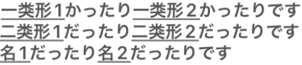  
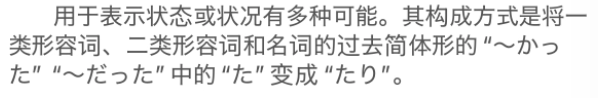  
tips：  
    * 句尾并不是总要后续“です”  
    * 形容词表示多种可能多用反义词  
  
  
  
  
- [ ] ****小句（简体形） + か****  
用于表示某种不确定的内容  
  
* ****小句（简体形）+ ==かどうか==****  
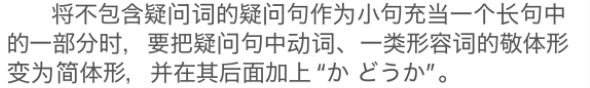  
  
かどうか 有种“是否”的意思，表达对前面内容的不确定  
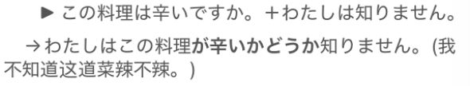  
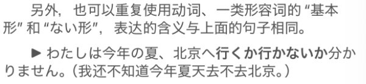  
  
* ****疑问词小句（简体形） + ==か==****  
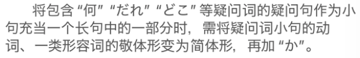  
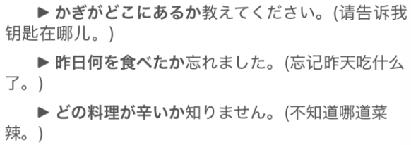  
  
  
注意：形2/名词 和 か　之间==不加“だ”==  
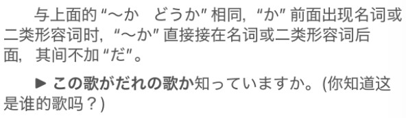  
  
  
  
  
- [ ] ****〜によって****  
よる　因る				由于；基于；取决于「自动·五段」  
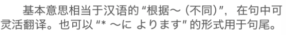  
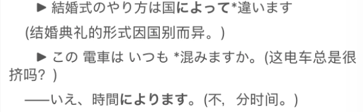  
  
- [ ] ****单词****  
* n  
    * あじ　味							味道；滋味  
    * まいかい　毎回  
    * ==つう==きん　==通==勤  
        * こう==つう==　交==通==  
    * きじ　生地						布料；材料；质地  
        * 記事  
    * ==へいてん==じこく　==閉店==時刻  
    * かいてんじ==こく==　開店時==刻==  
        * 〜時間  
    * そつぎょう==しき==　卒業==式==			毕业典礼  
    *   
  
* v  
    * きまる　決まる					决定「自动·五段」  
        * き = 记 ，まる =丸(圆圈)	(决定的事要记上一个圈)  
    * きめる　決める					决定「他动·五段」  
    * よる　因る　由る					由于；基于；取决于「自动·五段」  
        * よる　夜  
    * しらせる　知らせる				通知；告知「他动·一段」（记忆：++希腊塞露++）  
        * 知る的使役型	使别人知道就是告诉  
        * 同义词：教える　伝える  
    * ==たしか==める　==確か==める				确认；核实；查明「他动·一段」  
        * 记忆：确定(確か)没了(める) 。查明了  
  
* adj  
    * こい　濃い						浓；深；稠密；亲密  
        * こい　恋　					恋爱；爱情「名·サ变」  
    * うすい　薄い  
    *   
  
* 语句  
    * あっ、そうだ						表示突然想到/想起某事“啊，对了，我想起来了”  
    * 〜によって　〜によります			根据～的不同  
  
  
  
  
  
