# 6-24 简体形-应用  
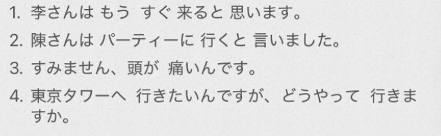  
final：  
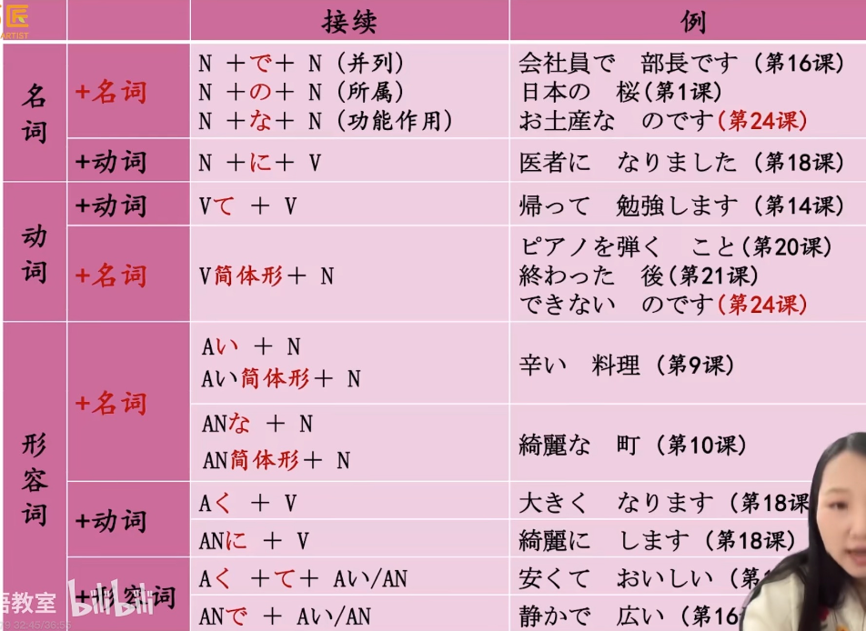  
  
- [ ] ****小句（简体形） +== と思います==****  
表示说话人的想法：我想… （小句） 	我觉得….（小句）  
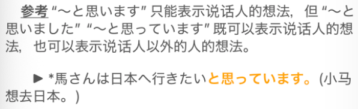  
  
- [ ] ****「人」は＋小句（简体形） + ==と言いました==****  
向第三者转述他人所说的话：谁谁说….（小句）  
  
  
注意：形2/名词 和 と　之间==必须加“だ”==  
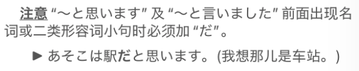  
  
  
- [ ] ****简体形 + のです/んです****  
* ****解释说明的语气。****  
可以把它理解为一种 “包装”。普通的句子只是在传递“事实”，而加上了 んです 的句子，则是在传递 “背后语境/原因/解释”。使用 んです 时，你其实是在告诉听者：“我接下来说的话是有**前因后果**的，请注意这个逻辑链。”  
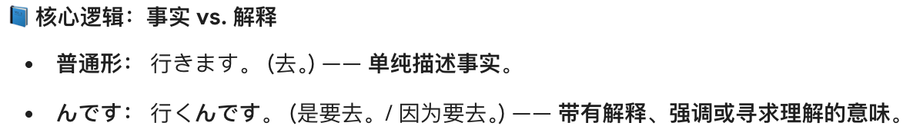  
  
* の：形式名词。遵守+N的接续规则  
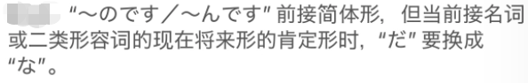  
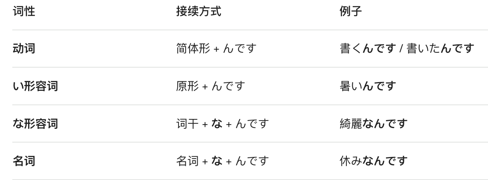  
  
* どうして〜んですか  
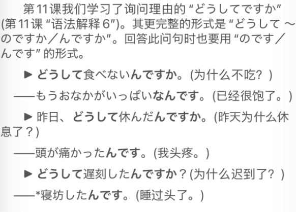  
  
  
- [ ] ****どうやって〜　どうして〜：询问方法/理由****  
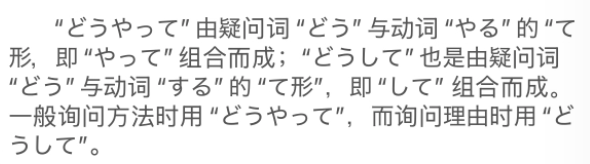  
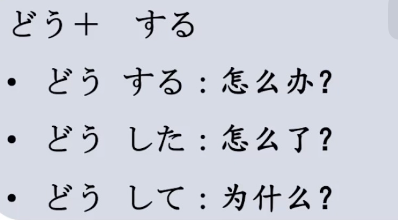  
どう　指示词，但是具有副词的性质  
  
  
- [ ] ****动词连用形 + 中****  
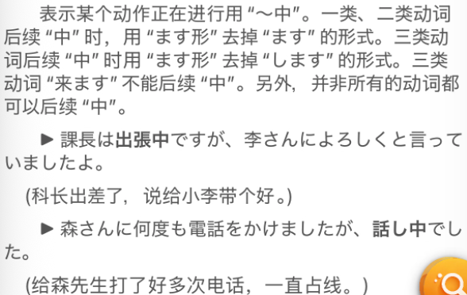  
  
  
- [ ] ****单词****  
* n  
    * ハイキング					徒步旅行hiking  
    * おわかれ　お別れ				分手；告别；离别  
        * 动词连用形 別れる　分かれる  
    * はなし　話し					谈话；话题；故事  
        * 話す　		动词的連用式  
        * 話し手		说话者；讲述人；发言人  
        * 聞き手		听者；听众  
    * ほうりつ　法律  
        * 记忆：法律是神圣的，ほうり（holy）つ	神圣的词  
    * やく　役						角色；职务；任务  
    * せわ　世話					关照；帮助；照顾；介绍「サ变」  
        * 记忆：帮忙介绍照顾成为世话（世间的闲话/评价）  
    * あいだ　間					间隔；期间；中间  
        * この間はお世話になりました		这期间承蒙关照  
    *   
    * ねぼう　寝坊					睡懒觉；早晨起得晚「形动·サ变」  
        * 寝坊します  
    * けんきゅう　研究				研究「他动·サ变」  
        * 法律について研究している	  
    * がいしゅつ　外出				外出；出门「自动·サ变」（记忆：她外出 ++改袖子++ 。）  
        * 注意这里拗音直音化，しゅ读作し	  
        * 外出する  
        * 出かける　==   家を出る  	出门  
    *   
* v  
    * おもう　思う					认为；想；觉得；以为；希望；「他动·五段」  
        * 想う	  
    * いう　言う					说；讲；表达；称为；叫做「自他动·五段」  
    * わらう　笑う					笑；嘲笑；花开；绽开「自他动·五段」  
        * 中文的笑：hhhhhhh，日语的笑：wwwwwww  
        * 自动词，笑            他动词，嘲笑  
    *   
  
  
* adj  
    * おかしい　可笑しい			奇怪；滑稽；可笑；不正常。  
        * おかし　お菓子  
    * すごい	凄い					非常；厉害；惊人；了不起  
  
* adv  
    * いっぱい　一杯・🈵			满的；很多；尽情地  
    * とうとう						终于；到底；毕竟  
        * とうとうお別れです	终于要告别了  
    * かならず　必ず				一定；必定；必然  
    * ぜったいに　絶対に			无论如何；必定；坚决  
        * 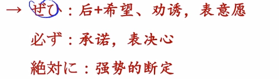  
  
* 助词  
    * ついて　就いて				关于；就；对于；每  
        * ==～について==				关于～  
  
* 语句  
    * お世話になりました  
    * 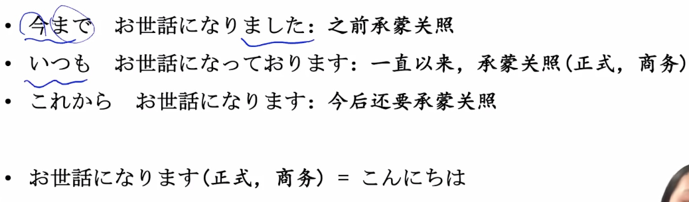  
    * 〜に　よろしく　お伝え　ください  
    * 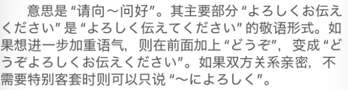  
  
==お + 动词连用形 + ください==  
    * 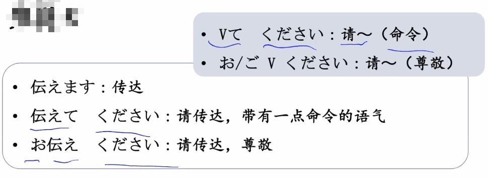  
  
  
  
  
    * お元気で　・　お気をつけて  
    * 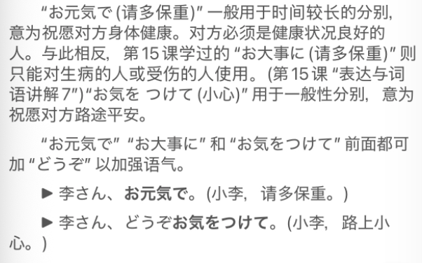  
    * やくにたちます　役に立ちます　有用，有帮助，实用(记忆：压哭你他气妈死)  
        * ～に役に立ちます　对～有用有帮助  
    * 都合が悪い　　　　　不方便  
  
  
  
  
  
  
  
  
  
  
  
  
  
  
  
  
  
  
  
  
