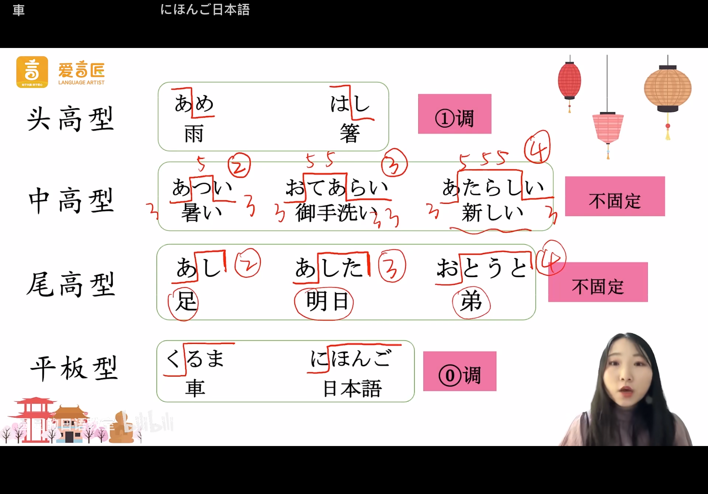

# 入门单元  
  
## Day01  
学唱《五十音》  
  
  
## Day02  
桜（さくら）	樱花  
富士山（ふじさん）		富士山  
寿司（すし）		寿司  
温泉（おんせん）		温泉  
  
学唱《小星星》  
  
  
## Day03  
****单词****  
茶（ちゃ）		茶  
書（しょ）		书  
食事（しょくじ）		吃饭  
主人（しゅじん）		主人  
  
****日常用语****  
1.回家时  
ただいま	我回来了  
おかえりなさい 	你回来啦  
  
2.吃饭时  
いただきます		我开吃啦  
  
学唱《动物之歌》	こぶた・たぬき・きつね・ねこ  
  
  
## Day04  
****声调****  
日语声调小窍门: 在读日语声调时，可以把低音的读成“mi(音级)”高音的读成so  
  
はし		筷子, 声调：so mi  
はし		桥, 声调：mi so  
  
  
==第一拍和第二拍的音调高低不同。==  
==一旦降调就不会再转为升调。==  
  
****单词：星期****  
曜日（ようび）  
  
月　げつ  
火　か	  
水　すい  
木　もく  
金　きん  
土　ど  
日　にち  
  
  
****日常用语****  
こんにちは	你好，日常问候  
おはよ  うございます	早上好，早晨第一次见面  
こんばんは	晚上好，晚上第一次见面  
おやすみなさい	晚安，晚上道别  
  
  
## Day05  
****日常用语****  
1.出门时  
いってきます		我出门了  
いってらっしゃい		路上小心  
  
2.表达感谢  
ありがとうございます		谢谢  
  
3.表达歉意  
すみません		对不起  
  
  
## Day06  
音读和音译  
音读和训读  
****总结:****  
训读:这个汉字本身所对应的日语读音  
音读:根据这个汉字本身汉语的发音发展而来的音  
  
****日常用语****  
はじめまして		初次见面  
わたしは＿＿です		我是__  
==よろしく==おねがい==します== 	请多多关照  
  
こちらこそ、よろしくね		哪里哪里，请你多多关照  
  
几种请多多关照  
どうぞ　よろしく  
よろしく　お願います  
どうぞ　よろしく　お願いします  
  
  
  
## Day07  
  
空那扣头 一一那， 带ki他啦 一一那  
俺那幼妹 空那幼妹， 一-趴一阿卢开斗  
敏娜敏娜敏～娜，卡那爱台 苦来噜   
复习gi哪 跑-开带，卡那爱台 苦来噜  
  
搜啦o 机油～你 投币他姨妈  
嗨一，他开口扑他  
昂，昂，昂，投-胎猫大姨死ki，哆啦A梦嗯  
  
  
  
  
  
  
  
  
  
  
  
  
  
  
  
