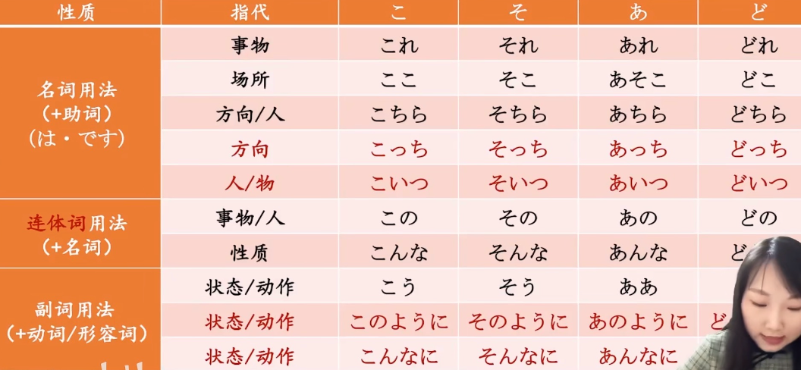
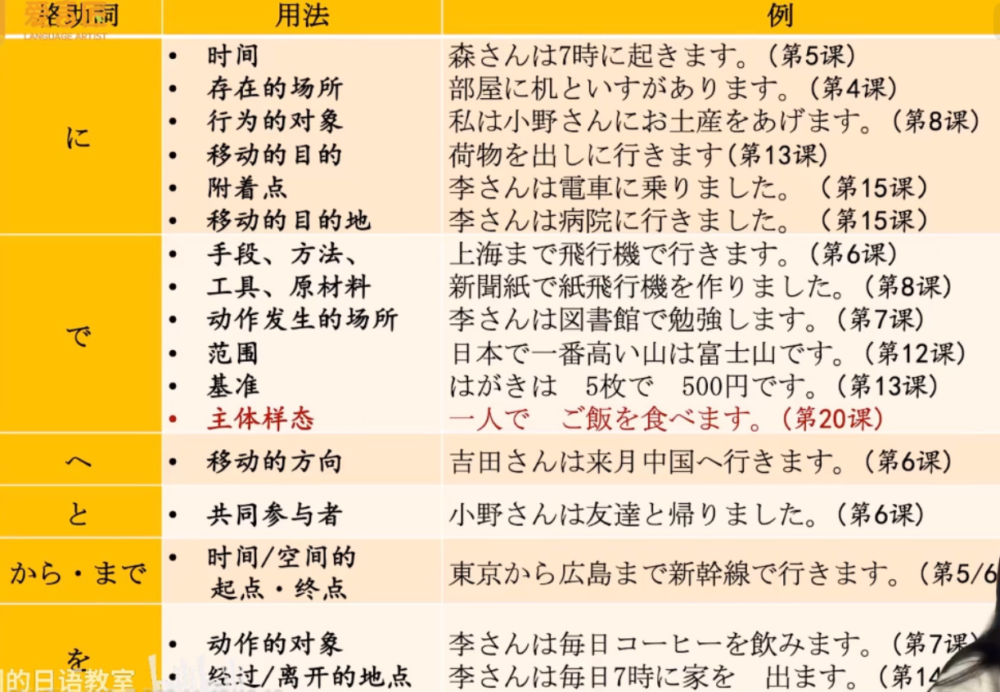
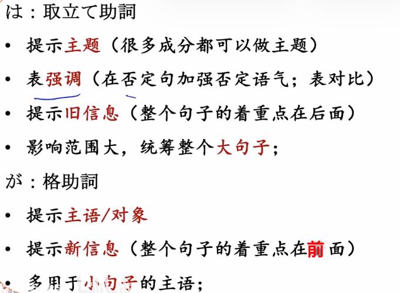
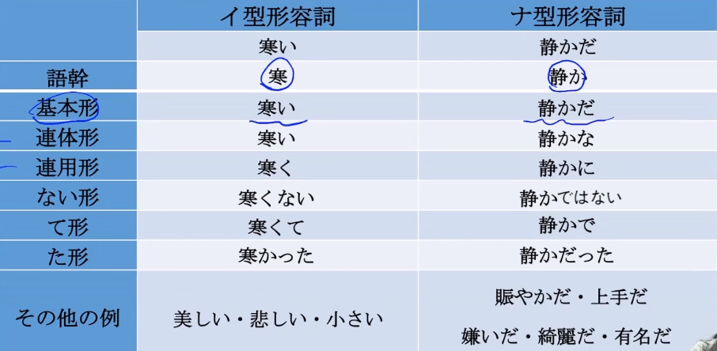
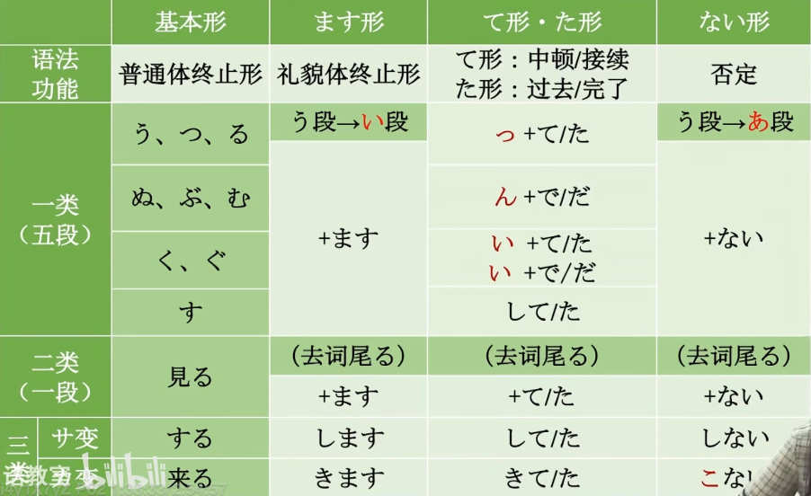
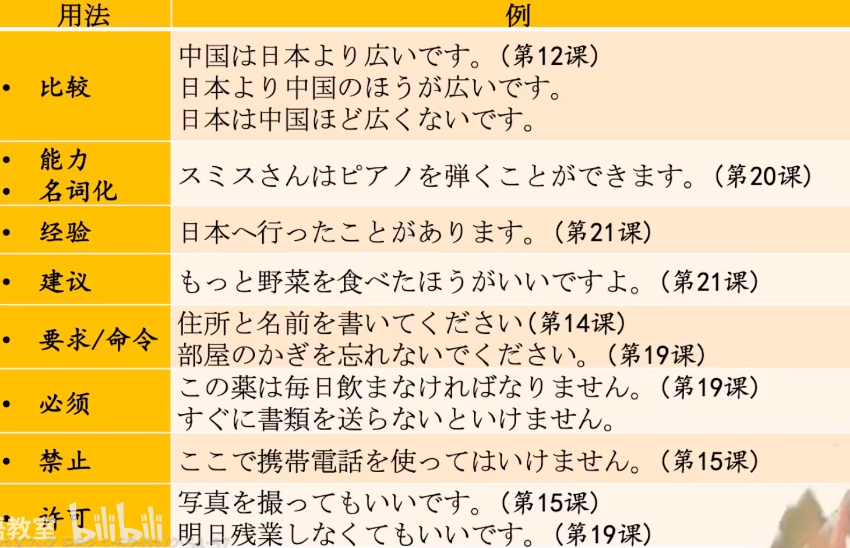
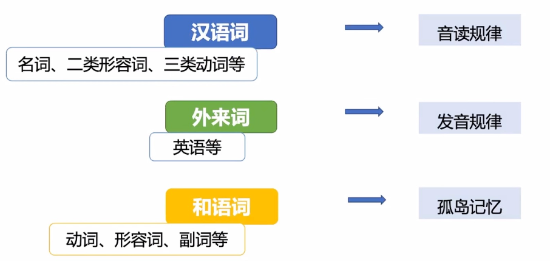
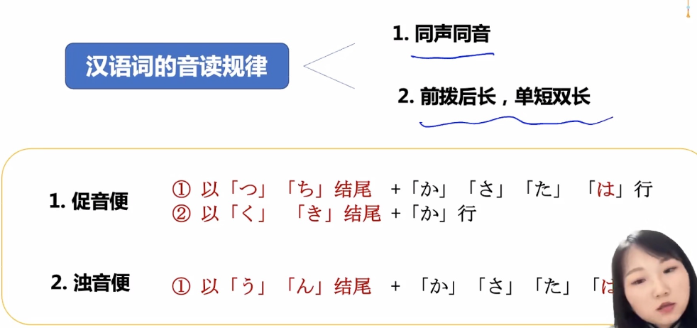
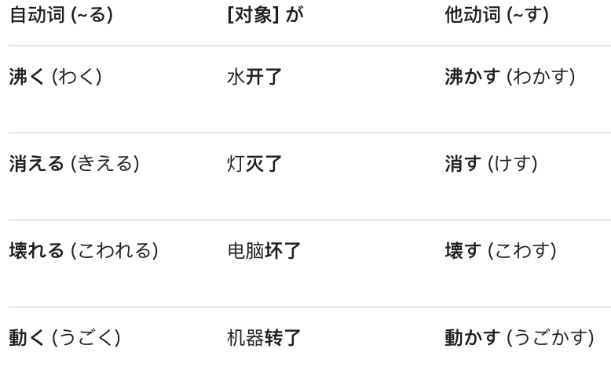
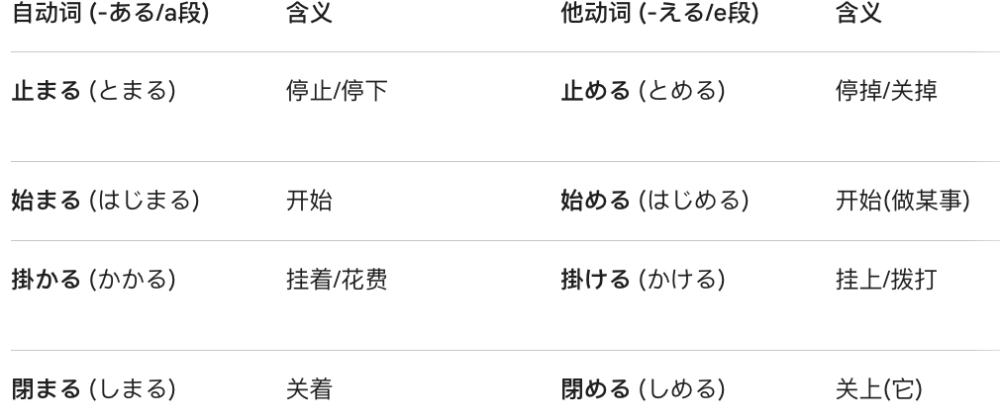

# 总结  
  
- [ ] ****指示词****  
  
  
- [ ] 格助词  
  
  
- [ ] 接续  
  
  
- [ ] ****は和が的区别****  
  
  
  
- [ ] ****形容词分类&活用****  
  
  
- [ ] ****动词分类&活用****  
  
  
  
- [ ] 细碎句型  
  
  
  
  
- [ ] ****单词记忆****  
* 单词分类  
  
  
* 汉语词的音读规律  
  
  
Ps：前：指的是汉语拼音前鼻音，an en in。后：指的是后鼻音，ang eng ing。  
单：指的是汉语拼音单元音，a o e i u ü。后：指的是后鼻音，ai ei ao ou。  
  
  
* ==自他动词 [る/す] 判定法：==  
- 看到「す」结尾： 90% 概率是他动词  
- 看到「る」结尾： 90% 概率是自动词  
  
  
  
* ==自他动词 [a/e] 判定法：==  
**「-（e段）る」是他动词**，  
**「-（a段）る」是自动词**。  
  
  
